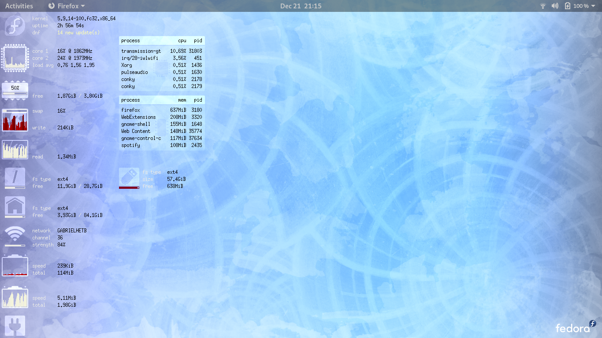
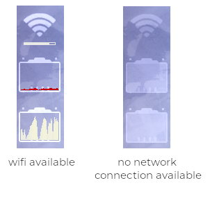
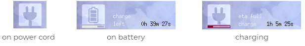

# Monochrome Conky
A graphical conky interface to monitor your **fedora** system.  Available in two flavors:

## Laptop mode
Built for systems with small screen real state.  The desktop below is 1366 x 768.


## Desktop mode
*Coming soon*

# Features
## Network modes

## Power modes


# How to install
## Dependencies
You only require to have `conky` installed on your system.

On **Fedora** install it by running:

```
sudo dnf install conky
```

**n.b.** I recommend using the conky package version `1.11.5_pre`.
More recent versions may have regressions that cause the theme to behave erratically.  Run the command `dnf downgrade conky` until you arrive at this version.

## How to run
1. Unzip the project's zip file in the folder `~/scripts/conky`
1. Rename the root folder `monochrome-master` to `monochrome`
1. Run the launch script `~/scripts/conky/monochrome/small/launch.bash`

# Future enhancements
- [ ] In the absence of wifi, the upload/download meters should work when connected to a LAN
- [ ] Implement desktop mode