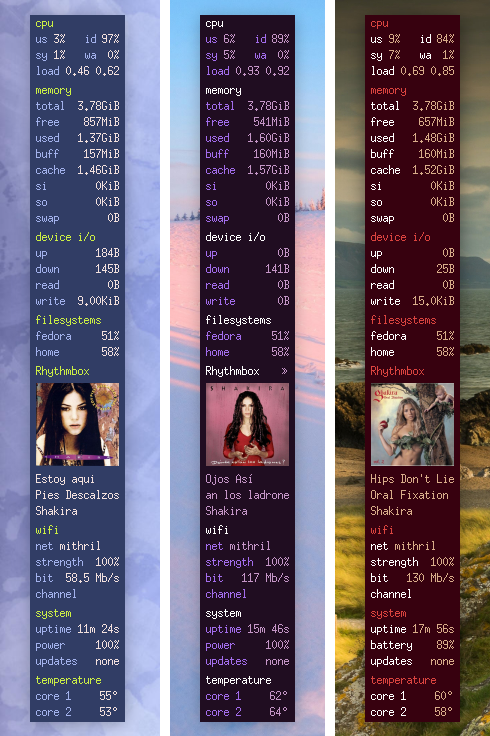

# Monochrome Conky
A collection of graphical [conky](https://github.com/brndnmtthws/conky) interfaces to monitor your system.  
Keep tabs on your system's cpu, memory, disk, network, battery usage and device temperatures.

### Blocks


### Classic


### Compact dock


### Glass dock


### Widgets dock


### Widgets


## Additional monitoring features

- A paginated list of new package updates for the Fedora **dnf** package manager
- Torrent uploads and downloads for the **transmission** bittorrent client
- Music player support for **Rhythmbox** and **Spotify**
- CPU (user/system/iddle/waiting on io) usage breakdown, read/write io usage for swap disk space

These details are retrieved with the use of [small scripts](https://github.com/ernesto1/monochrome/wiki/Scripts).

# How to install
## Dependencies
You only require to have `conky` installed on your system.  
On **Fedora** install it by running:

```
$ sudo dnf install conky figlet
```

**n.b.** I recommend using the conky package version `1.11.5_pre`  
more recent versions may have regressions/bugs ([issue 1](https://github.com/brndnmtthws/conky/issues/960), [issue 2](https://github.com/brndnmtthws/conky/issues/979)) that cause the theme to behave erratically.

Run the command `dnf downgrade conky` until you arrive at this version or download the RPM [from the web](https://rpm.pbone.net/info_idpl_70128821_distro_fedora32_com_conky-1.11.5-3.fc32.x86_64.rpm.html).

### Fonts
Download these fonts:

- [Promenade de la Croisette](https://www.fontspace.com/promenade-de-la-croisette-font-f23769)
- [Typo Round](https://www.dafont.com/typo-round.font)

## Download the code for these conky scripts
Create the `~/conky` directory and clone this repository

```shell
$ mkdir ~/conky
$ cd ~/conky
$ git clone https://github.com/ernesto1/monochrome.git
```
This will place all the code under the `~/conky/monochrome` directory.

Alternatively if you only want the conky configurations and their images, you can download the latest `monochrome.zip` file from the [releases page](https://github.com/ernesto1/monochrome/releases).  This way you don't get any of the build assets.

### Configuration
If you are new to conky, the [wiki](https://github.com/ernesto1/monochrome/wiki) outlines items that may require configuration in order to customize this conky to your system, ex. device names such as network cards and hard drives

### Building the Music Player App
The music player conky requires the supporting java app in order to function.  
You require `maven` and the `java jdk` in order to build it from source.

```shell
# ::: fedora users
# the java jdk comes installed by default
# to install maven run
dnf install maven

# ::: building the music app from source
cd ~/conky/monochrome/builder/java-tools
mvn clean package site-deploy
mkdir -p ~/conky/monochrome/java
rm -rf ~/conky/monochrome/java/*
cp -r */target/{lib,*.jar,*.properties,*.xml} ~/conky/monochrome/java
cp -r target/docs ~/conky/monochrome/java
```
If you don't want to build this manually, you can download the latest `monochrome.zip` file from the [releases page](https://github.com/ernesto1/monochrome/releases).

# How to run
Go into the conky monochrome folder

```cd ~/conky/monochrome```

Run the launch script with the theme you want:

Theme        | Command
-------------|------------------------------
Blocks       |`./launch.bash --conky blocks`
Classic      |`./launch.bash --conky classic --no-torrent`
Compact	     |`./launch.bash --conky compact`
Glass        |`./launch.bash --conky glass`
Widgets dock | `./launch.bash --conky widgets-dock`
Widgets      | `./launch.bash --conky widgets`

I recommend you take advantage of the launch script's `--silent` flag.  It suppresses conky logging which clutters the terminal (ex. `./launch.bash --conky compact --silent)`.

### Shutting down
To close all conkys and supporting jobs started by the launch script you can run the `shutdown` command

```shell
./launch.bash --shutdown
```