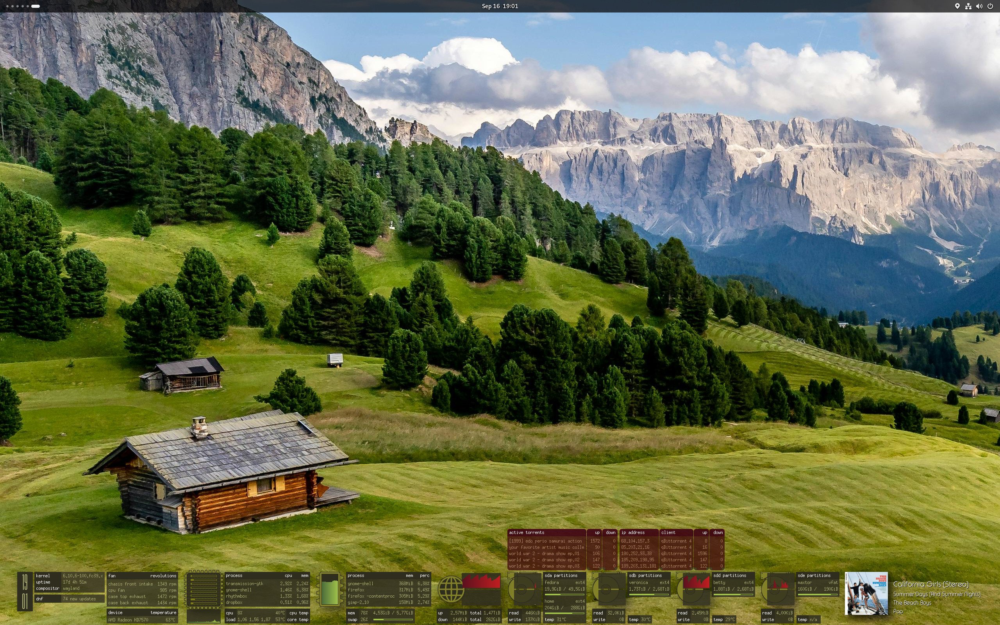

# Monochrome Conky
A collection of graphical [conky](https://github.com/brndnmtthws/conky) interfaces to monitor your system.  
Keep tabs on your system's cpu, memory, disk, network, battery usage and device temperatures.

### Compact dock


### Glass dock


### Widgets dock
Conky | Color themes
--- | ---
 | 

### Widgets


# Scripts
These shell scripts were written to support this conky setup:

- A launcher script for executing multiple conky configs
- A script to monitor for new package updates

For more details on these scripts [see this wiki](https://github.com/ernesto1/monochrome/wiki/Scripts).

# How to install
### Dependencies
You only require to have `conky` installed on your system.  
On **Fedora** install it by running:

```
$ sudo dnf install conky
```

**n.b.** I recommend using the conky package version `1.11.5_pre`  
more recent versions may have regressions/bugs ([issue 1](https://github.com/brndnmtthws/conky/issues/960), [issue 2](https://github.com/brndnmtthws/conky/issues/979)) that cause the theme to behave erratically.

Run the command `dnf downgrade conky` until you arrive at this version or download the RPM [from the web](https://rpm.pbone.net/info_idpl_70128821_distro_fedora32_com_conky-1.11.5-3.fc32.x86_64.rpm.html).

### Fonts
Most fonts used should come by default in your distro:

- [Promenade de la Croisette](https://www.fontspace.com/promenade-de-la-croisette-font-f23769)
- Nimbus Mono PS Regular
- Noto Sans CJK JP Thin
- URW Gothic
- URW Gothic Demi

### Download the code for these conky scripts
Create the `~/conky` directory and clone this repository

       $ mkdir ~/conky
       $ cd ~/conky
       $ git clone https://github.com/ernesto1/monochrome.git

Alternatively if you only want the conky configurations and their images, you can download the latest `monochrome.zip` file from the [releases page](https://github.com/ernesto1/monochrome/releases).  This way you don't get any of the build assets.

### Configuration
The [wiki](https://github.com/ernesto1/monochrome/wiki) outlines items that may require configuration in order to customize this conky to your system, ex. device names such as network cards and hard drives


# How to run
Run the launch script with the theme you want:

    - Glass dock

      $ ~/conky/monochrome/launch.bash --glass

    - Compact dock

      $ ~/conky/monochrome/launch.bash --compact

    - Widgets dock

      $ ~/conky/monochrome/launch.bash --widgets-dock

    - Widgets

      $ ~/conky/monochrome/launch.bash --widgets
