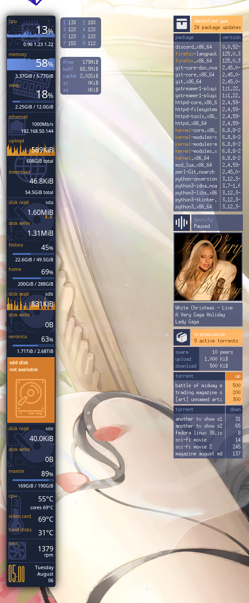

# Monochrome Conky
A collection of graphical conky interfaces to monitor your system.

If you are new to conky, this [project's wiki page](https://github.com/ernesto1/monochrome/wiki) has  helpful guides to show you how to customize the conky configs to your system.

### Glass theme


### Compact theme


### Widgets | small


### Widgets | large


## Scripts
### Repository package updates
`dnf`, the fedora package manager is **periodically** queried for new packages if the system is **iddle**. Slow machines will appreciate this, since a dnf package lookup may bring the cpu to a crawl.

**n.b.** `dnf` is specific to **fedora** linux.  If you use a different distro, you will have to [update the script](https://github.com/ernesto1/monochrome/wiki) to use your distro's package manager.

# How to install
### Dependencies
You only require to have `conky` installed on your system.  
On **Fedora** install it by running:

```
$ sudo dnf install conky
```

**n.b.** I recommend using the conky package version `1.11.5_pre`  
more recent versions may have regressions/bugs ([issue 1](https://github.com/brndnmtthws/conky/issues/960), [issue 2](https://github.com/brndnmtthws/conky/issues/979)) that cause the theme to behave erratically.

Run the command `dnf downgrade conky` until you arrive at this version or download the RPM [from the web](https://rpm.pbone.net/info_idpl_70128821_distro_fedora32_com_conky-1.11.5-3.fc32.x86_64.rpm.html).

### Fonts
The small widgets [time conky](https://github.com/ernesto1/monochrome/blob/master/widgets-small/sidebar-time) requires the following fonts:

- [Promenade de la Croisette](https://www.fontspace.com/promenade-de-la-croisette-font-f23769)
- Noto Sans CJK JP Thin (default on fedora)

### Configuration
- The [wiki](https://github.com/ernesto1/monochrome/wiki) outlines items that may require configuration in order to customize this conky to your system, ex. device names such as network cards and hard drives
- If you run a multi monitor setup, you can read how to configure conky to show on a [particular monitor](https://github.com/ernesto1/monochrome/wiki#multi-monitor-setups)

# How to run
1) Create the `~/conky` directory and clone this repository

       $ mkdir -p ~/conky
       $ cd ~/conky
       $ git clone https://github.com/ernesto1/monochrome.git

2) Run the launch script with the theme you want:

    - Glass

          $ ~/conky/monochrome/launch.bash --glass

    - Compact

          $ ~/conky/monochrome/launch.bash --compact

    - Widgets small

          $ ~/conky/monochrome/launch.bash --widgets-small --layout-override laptop

    - Widgets large

          $ ~/conky/monochrome/launch.bash --widgets-large
