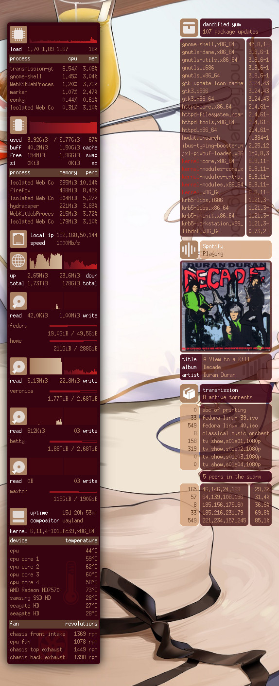

# Monochrome Conky
A collection of graphical conky interfaces to monitor your system.

If you are new to conky, this [project's wiki page](https://github.com/ernesto1/monochrome/wiki) has  helpful guides to show you how to customize the conky configs to your system.

### Glass theme


### Compact theme
Setup shown in a 1366 x 768 pixels resolution


### Widgets | small
Built for systems with small screen real state. The resolution below is 1366 x 768 pixels.


### Widgets | large
Built for systems with ample screen real state available.  The resolution below is 2560x1600 pixels.


### Blame theme
Inspired by the killy's heads up display from the anime movie Blame!. Setup shown in a 1366 x 768 pixels resolution.


## Features
### Repository package updates
DNF is periodically queried for new packages **if the system is iddle**.  
Slow machines will appreciate this, since a dnf package lookup may bring the cpu to a crawl.

**n.b.** `dnf` is specific to **fedora** linux.  If you use a different distro, you will have to [update the script](https://github.com/ernesto1/monochrome/wiki) to use your distro's package manager.

### Network modes
Network devices reflect the way you are connected to the internet.  
Depending on your linux distribution, you may need to [configure the proper network device name](https://github.com/ernesto1/monochrome/wiki#network-devices).


### Power modes
Different states to show how your laptop is consuming power 


### USB storage
USB devices are available for you to mix and match to the hardware you have.

These elements are considered **optional**.  Their state will change depending on whether the device is plugged in or not.
See the wiki entry for [how to configure these devices](https://github.com/ernesto1/monochrome/wiki#usb-drives) for your system.


### Hard drive i/o
If you have additional hard drives in your system (internal or external), the hard disk i/o conky allows you to monitor read/writes to the disk as well as space usage accross its different partitions.

This conky must be fully customized to your particular setup.  Read the [wiki for more details](https://github.com/ernesto1/monochrome/wiki#hard-drive-io).


# How to install
### Dependencies
You only require to have `conky` installed on your system.  
On **Fedora** install it by running:

```
$ sudo dnf install conky
```

**n.b.** I recommend using the conky package version `1.11.5_pre`  
more recent versions may have regressions/bugs ([issue 1](https://github.com/brndnmtthws/conky/issues/960), [issue 2](https://github.com/brndnmtthws/conky/issues/979)) that cause the theme to behave erratically.  Run the command `dnf downgrade conky` until you arrive at this version.

### Configuration
- The [wiki](https://github.com/ernesto1/monochrome/wiki) outlines items that may require configuration in order to customize this conky to your system
- If you run a multi monitor setup, you can read on how to configure conky to show on a [particular monitor](https://github.com/ernesto1/monochrome/wiki#multi-monitor-setups)

# How to run
1) Unzip the project's zip file in the folder `~/conky`

```
$ unzip -d ~/conky monochrome-master.zip
```

2) Rename the root folder `monochrome-master` to `monochrome`

```
$ mv ~/conky/monochrome-master ~/conky/monochrome
```

3) Run the launch script with the theme you want:

Glass

```
$ ~/conky/monochrome/launch.bash --glass --layout-override desktop
```

Compact

```
$ ~/conky/monochrome/launch.bash --compact
```

Widgets small

```
$ ~/conky/monochrome/launch.bash --widgets-small
```

Widgets large

```
$ ~/conky/monochrome/launch.bash --widgets-large
```

Blame

```
$ ~/conky/monochrome/launch.bash --blame --layout-override laptop
```