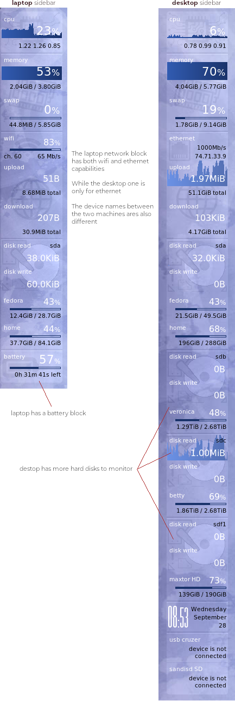

# Dynamically building a conky sidebar configuration
## Design Overview
Each section of a sidebar can be thought of as a **block**.  These blocks can assembled together in order to build a conky sidebar.

Blocks:

- CPU
- Memory
- Network interface (wifi, ethernet)
- Disk
- Power/battery
- Device temperatures

With this setup, we have the flexibility to easily rearrange/add blocks in order to customize the sidebar for the type of system we wish to monitor.

If we compare the use case of monitoring a laptop vs a desktop; a pc will most likely have multiple disks to monitor, while a laptop introduces power implications (on battery, charging, plugged in) not applicable to a desktop.

## Design considerations
1. If a block contains an image, the image's `y coordinate` would **change** depending where in the stack the particular block is placed.
1. The `vertical offset` of the last line or graph in a block must be consistent.  We want to be able to place a block anywhere in the sidebar stack and not have to worry about it's text/graph alignment shifting.