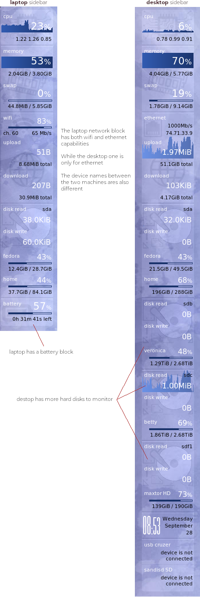

# Dynamically building a conky sidebar configuration
Each section of a sidebar can be thought of as a **block**.  These blocks can be assembled together in order to build a conky sidebar.

Block examples:

- CPU
- Memory
- Network interface (wifi, ethernet)
- Disk
- Power/battery
- Device temperatures

With this setup, we have the flexibility to easily rearrange/add blocks in order to customize the sidebar for the type of system we wish to monitor.

If we compare the use case of monitoring a laptop vs a desktop; a pc will most likely have multiple disks to monitor, while a laptop introduces power implications (on battery, charging, plugged in) not applicable to a desktop.